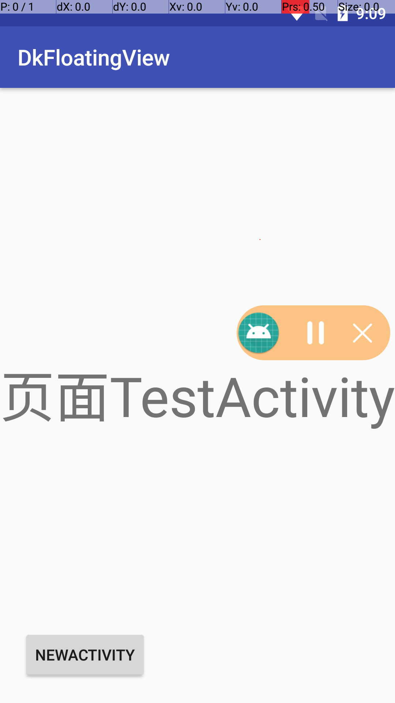

# 应用内悬浮窗[](https://jitpack.io/#Doonkey/DkFloatingView)

应用内悬浮窗，基本无侵入性，无权限申请，简单配置，全局可用，支持滑动，点击事件

> 基于开源项目修改，感谢作者；[https://github.com/leotyndale/EnFloatingView](https://github.com/leotyndale/EnFloatingView)


### 预览图



### 使用说明

#### 导入依赖
 Step 1. 添加JitPack仓库到根目录build.gradle文件
 
	allprojects {
		repositories {
			...
			maven { url 'https://jitpack.io' }
		}
	}
Step 2. 在module添加依赖,${version}版本[](https://jitpack.io/#Doonkey/DkFloatingView)

	dependencies {
	        implementation 'com.github.Doonkey:DkFloatingView:${version}'
	}

#### 初始化

 ```Java
 FloatWindow.with(this)//application上下文
                 .setLayoutId(R.layout.float_music)//悬浮布局
                 //.setFilter(Test1_1Activity.class)//过滤activity
                 //.setLayoutParam()//设置悬浮布局layoutParam
                 .build();
 ```


#### 点击监听

 ```Java
 FloatWindow.get()//悬浮窗实例
            .setOnClickListener(new DkFloatingView.ViewClickListener() {
             @Override
             public void onClick(int viewId) {//viewId
                 switch (viewId){
                 ...
                 }
             }
         });
 ```


#### 显示/隐藏

 ```Java
 FloatWindow.get().show();//显示
 FloatWindow.get().hide();//隐藏 
 ```


